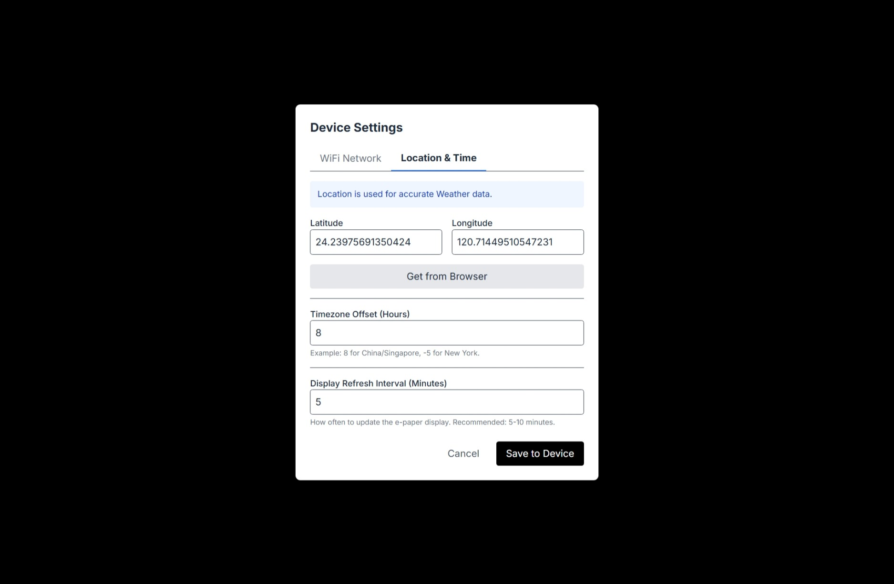

# Project Screenshots & Samples

This page showcases the visual aspects of the EPaperDash system, including the software interface and hardware configuration.

---

## 1. Visual Web Configurator
The main interface where you design your dashboard layout.

*The drag-and-drop editor featuring various widgets and alignment tools.*

---

## 2. Hardware in Action
Real-world display effect on the 5.83" E-Paper.

*High-contrast rendering with dynamic weather and time updates.*

---

## 3. Communication & Logs
Direct interaction with the ESP32 through the built-in serial monitor.

*Real-time logs showing terminal communication and bridge status.*

---

## 4. Configuration Interfaces
Web-based setup for device settings.

### WiFi Configuration

*Easily set up SSDI and Password via the WebSerial bridge.*

### Location & Timezone

*Configure Latitude, Longitude, and Timezone for accurate weather and time sync.*

---

[Back to Main README](../README.md)
